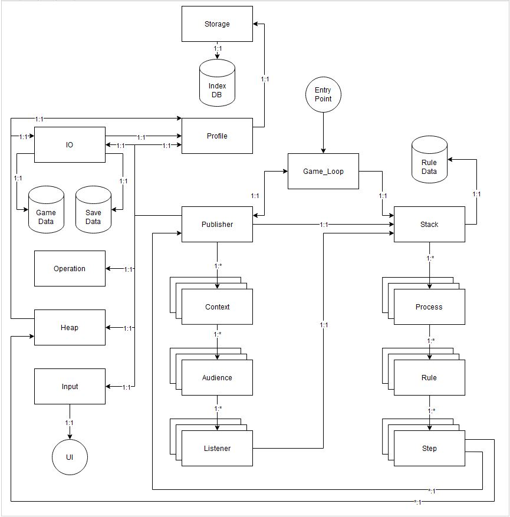

# TableTopTapper 

### Table of Contents
 - [Overview](#overview)
 - [Architecture](#architecture)
 - [Entry Point](#entry-point)
 - [Game Loop](#game-loop)
 - [Stack](#stack)

## Overview

### What is it?
TableTopTapper is a language framework built on top of javascript to write table top games that will run in a pure browser based environment with zero dependencies. All of the individual files end up being bundled together into one single html file that can be opened locally, this is done to get around CORS issues. The bundler is written in python just cause that is what I had setup locally and wasn't trying to get bogged down setting up the perfect env when in reality I didn't even get to porting a full working demo into the engine. 

### Why Did I Stop?
At a certain point I kind of had to ask myself, what was I doing creating a programming language to write a game? It was a very interesting exercise and I learned a lot. I do not regret it, but I found myself spending more time making the engine than actually making the game. Why did I cut myself off from the built in debugging tools by creating another abstraction layer on top of javascript? In general it did not lend itself well to a growing scope creep for going fast.

## Architecture


This is basically a programming language that has as stack with multiple Processes(threads) that have Rules(functions) with Steps(lines of code). All the systems are connected together using events and promises, such that each step that is evented awaits until the underlying system resolves it's promise and stores it's results. Processes can interupt other processes to run a section of logic before resuming the parent process, and can even edit the data in the parent process to change behavior. This latter behavior is primarily handled by the Context>Audience>Listener domain, which is a glorified event listener with multiple levels allowing a scoping of events as well as toggles allowing event logic to be turned on/off as needed. Beyond the data stores most of the other objects are functions for performing an operation that each Step would call.

## Entry Point
[Entry Point](js/entry_point.js)

This is the start of the program. 
	- Here we wire up all the events from their objects and classes to the publisher which is how all the systems communicate. 
	- The profile has all the state systems wired up such that on save/load the state can be pushed/pulled from the indexdb and inflated/deflated.
	- All the operations each utility object is capable of is wired up such that the object it belongs to can be reverse look-up'ed for eventing
	- The game loop is wired up to the start button to trigger the loop to begin

## Game Loop
[Game Loop](js/game_engine/game_loop.js)

This is where the main meat and potatoes of the application begins. It is equivalently the main logic handling, running each rule contained in a process. It also has a default action/rule that it will default to once it has cleared all operations.

Operation Logic:
- run:
  - Make sure only one loop can be running at a time
  - Get the process from the stack
  - Get the next rule from the process
  - Setting itself to a Waiting state 
  - Call next on the rule and await the current rule's > step's promise to resolve
	  - If the promise is rejected 
      - And it is an error then log the error and halt the program
      - Else it is a Process interupt that will spawn a new Process that once finished will resume the parent process where it left off
        - Finally it emits an event that says the game loop has processed completing the step operation
		- Get the next process and the next rule(Which could be the same process and rule but at the next step)
        - Loop back to the top and repeat until it has consumed all process's their rule's and the steps within
		- Once it has run out of Process>Rules>Steps to perform
        - Update the state to Finished
		- Trigger a save of all the state if the state has changed
		- Set the state to None
		- Emit game_loop.finished (which the heap is wired up to, triggering it to purge the heap)
		- Then reset the game_loop back to the default action starting the process all over again

## Stack
[Stack](js/game_engine/stack.js)

This is a FILO Queue of Processes(Threads) that has a variety of functionality to it. It has responsibility of maintaining the stack process pointers and manipulating the stack.

Operation Logic:
	- get_process:
		- Returns the process at a given index and the index defaults to 0(top of the queue)
		- As it is called if a process is finished it will handle removing it from the queue
		- When a process is shifted from the queue the next on defaults to 0 and the process repeats
	- new_process:
		- push a new process onto the stack to be processed in the next game loop pass
		- It will also return the index from the right to the caller that is it's own index
			- It returns the right index so that as things get pushed on before it, the index does not become broken
	- branch:
		- Is basically a if statement 
			- It takes a condition
				- If true run the first command
				- Else run the second command
				- If either commands are null and their condition triggers then it just passes through
		- EX: 
		```
				{"id": "die", 		"action": "branch", 	"args": [["<roll>", "<", 2],  
																									{"action":"inject", "args":["dice.usage.fail", ["<die>", "<die_path>", 2]]}, 
																									{"action":"resolve", "args":["<die>"]}]}
		```
	- loop
		- It is a looping function call
			- It will call a rule for every entry in a collection passed to it
			- The keyword ```$idx$``` will be resolved to the element value at each pass as it loops through the collection calling the rule with it
			- Other hardcoded values or variables can be passed in as well

## License
MIT NON-AI License

Copyright (c) 2023, <copyright holders>

Permission is hereby granted, free of charge, to any person obtaining a copy of the software and associated documentation files (the "Software"),
to deal in the Software without restriction, including without limitation the rights to use, copy, modify, merge, publish, distribute, sublicense,
and/or sell copies of the Software, and to permit persons to whom the Software is furnished to do so, subject to the following conditions.

The above copyright notice and this permission notice shall be included in all copies or substantial portions of the Software.

In addition, the following restrictions apply:

1. The Software and any modifications made to it may not be used for the purpose of training or improving machine learning algorithms,
including but not limited to artificial intelligence, natural language processing, or data mining. This condition applies to any derivatives,
modifications, or updates based on the Software code. Any usage of the Software in an AI-training dataset is considered a breach of this License.

2. The Software may not be included in any dataset used for training or improving machine learning algorithms,
including but not limited to artificial intelligence, natural language processing, or data mining.

3. Any person or organization found to be in violation of these restrictions will be subject to legal action and may be held liable
for any damages resulting from such use.

THE SOFTWARE IS PROVIDED "AS IS", WITHOUT WARRANTY OF ANY KIND, EXPRESS OR IMPLIED, INCLUDING BUT NOT LIMITED TO THE WARRANTIES OF MERCHANTABILITY,
FITNESS FOR A PARTICULAR PURPOSE AND NONINFRINGEMENT. IN NO EVENT SHALL THE AUTHORS OR COPYRIGHT HOLDERS BE LIABLE FOR ANY CLAIM,
DAMAGES OR OTHER LIABILITY, WHETHER IN AN ACTION OF CONTRACT, TORT OR OTHERWISE, ARISING FROM, OUT OF OR IN CONNECTION WITH THE SOFTWARE
OR THE USE OR OTHER DEALINGS IN THE SOFTWARE.


## Also
There is technically some copywrited text in the json, but it is not enough to really be able to backwards engineer the game so I do not think it is a major issue. But if the content author requests that I remove it then I will. The goal was to convert the game rules into an engine but in the end it ended up being more work than it was worth but I wanted to at least have a semblance of a working demo to look back at.